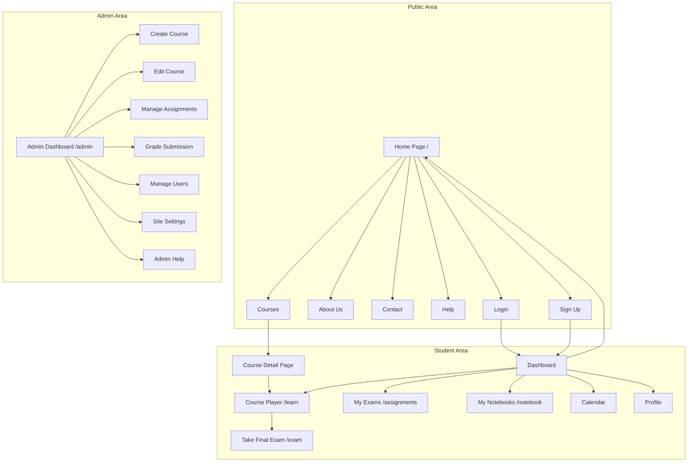
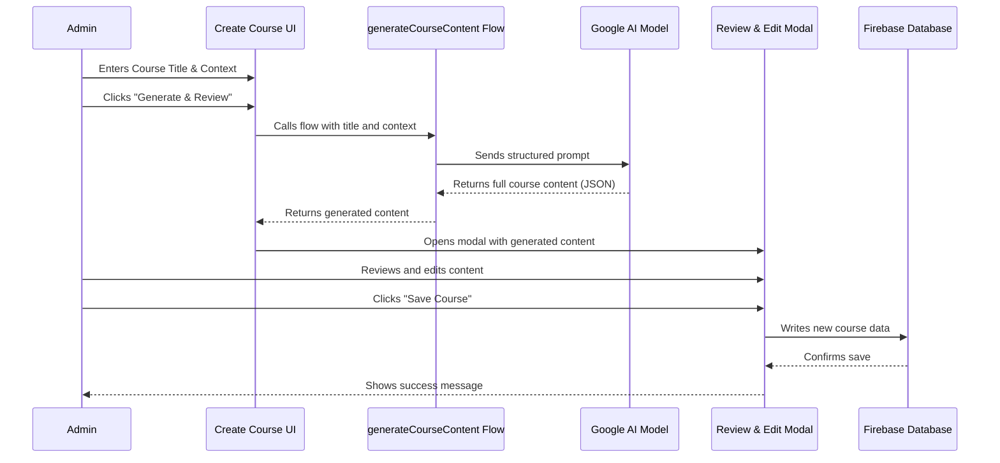
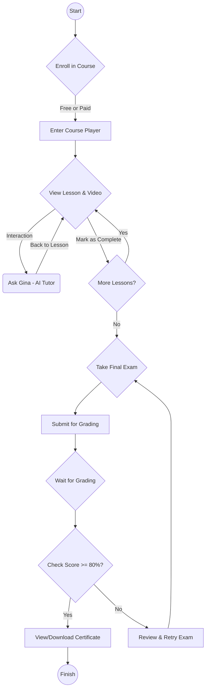
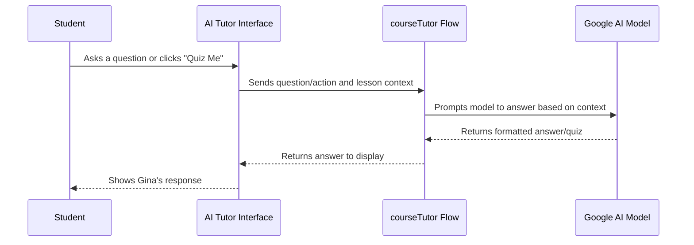
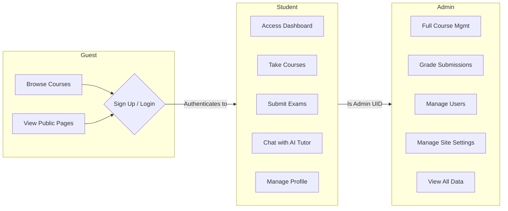

# Ubuntu Academy - Visual Framework

This document provides a graphical overview of the application's structure and key operational flows using Mermaid syntax. These diagrams can be rendered by GitHub or compatible Markdown editors.

## 1. Application Site Map

This diagram shows the main pages of the application and how they are interconnected. It distinguishes between public pages, student-authenticated pages, and the admin section.

## 2. AI-Powered Course Creation Flow (Admin)

This sequence diagram illustrates the process an administrator follows to generate a new course using the AI assistant.

## 3. Student Learning Path

This flowchart outlines the journey of a student from enrolling in a course to receiving their certificate.

## 4. AI Tutor Interaction Flow

This diagram shows how a student interacts with the "Gina" AI tutor within the course player.

## 5. Roles & Permissions Overview

This diagram provides a high-level view of what different user roles can access and do within the application.

