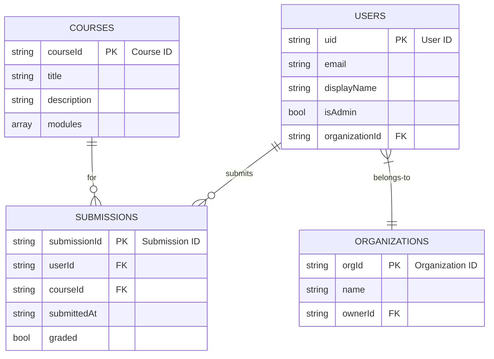

# Akili AI - Visual Framework

This document provides a visual representation of the application's architecture, user flows, and component interactions using Mermaid diagrams.

## High-Level Architecture

```mermaid
graph TD
    subgraph "Client (Next.js/React)"
        A[User Interface] --> B{React Components};
        B --> C[ShadCN UI];
        B --> D[Tailwind CSS];
        A --> E[Next.js App Router];
    end

    subgraph "Server-Side (Next.js)"
        E --> F[Server Components];
        E --> G[Server Actions];
    end

    subgraph "Backend Services"
        H[Firebase Auth]
        I[Firebase Realtime DB]
        J[Genkit AI Flows]
    end

    G --> H;
    G --> I;
    G --> J;

    F --> I;

    subgraph "AI/ML (Genkit)"
        J --> K[Google AI Platform];
    end

    style Client fill:#D6EAF8,stroke:#333,stroke-width:2px
    style "Server-Side (Next.js)" fill:#D1F2EB,stroke:#333,stroke-width:2px
    style "Backend Services" fill:#FCF3CF,stroke:#333,stroke-width:2px
    style "AI/ML (Genkit)" fill:#FDEDEC,stroke:#333,stroke-width:2px
```

## Component Architecture Diagram

This diagram shows how different UI components interact and form the user interface.

```mermaid
graph TD
    subgraph "Pages"
        P1[Course Player Page]
        P2[Admin Dashboard]
        P3[Home Page]
    end

    subgraph "Shared Components"
        C1[Header]
        C2[Footer]
        C3[Sidebar]
        C4[CourseCard]
        C5[MpesaModal]
    end

    subgraph "UI Primitives (ShadCN)"
        U1[Button]
        U2[Card]
        U3[Dialog]
        U4[Input]
    end

    P1 --> C1;
    P1 --> C2;
    P1 --> C3;
    P2 --> C1;
    P2 --> C2;
    P2 --> C3;
    P3 --> C1;
    P3 --> C2;
    P3 --> C4;

    C4 --> U1;
    C4 --> U2;
    C5 --> U3;
    C5 --> U1;
    C5 --> U4;
    P1 --> U1;
    P2 --> U2;

    style Pages fill:#E8DAEF
    style "Shared Components" fill:#D4E6F1
    style "UI Primitives (ShadCN)" fill:#D6EFE5
```

## Security Visual Framework

This diagram illustrates the security layers, from user authentication to database access rules.

```mermaid
graph LR
    A[User] -->|HTTPS| B(Next.js Frontend);

    subgraph "Firebase"
        C[Firebase Authentication]
        D[Firebase Realtime DB]
        E[Database Security Rules]
    end

    B -->|Login/Signup| C;
    C -->|Auth Token (JWT)| B;
    B -->|Server Actions| F[Next.js Backend];
    F -->|Authenticated Requests| D;
    D -- Enforces --> E;
    E -- Defines Access --> D;

    style Firebase fill:#FDEBD0,stroke:#F39C12
```

## Database Framework

This diagram shows a simplified version of the Firebase Realtime Database schema and relationships.


