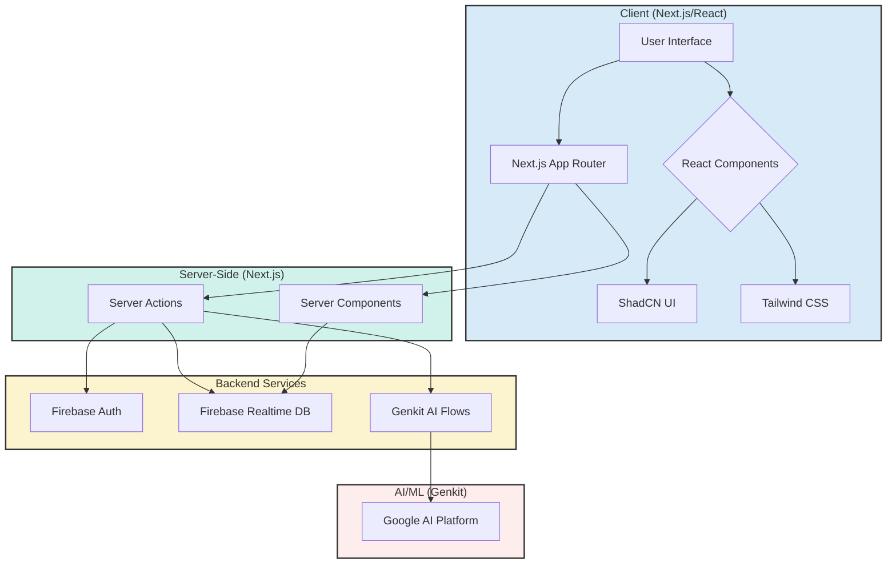
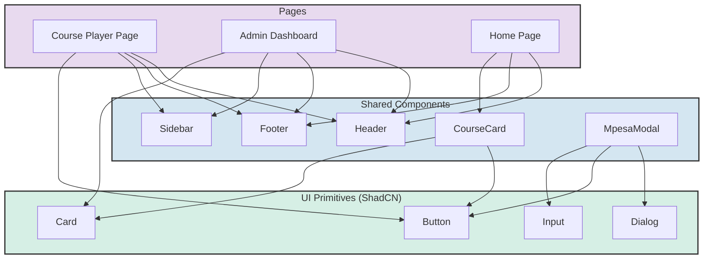
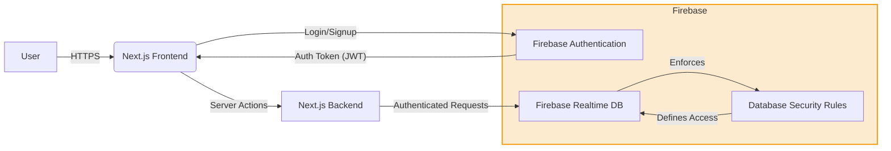
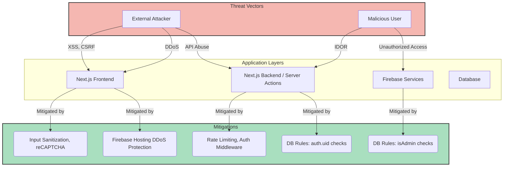
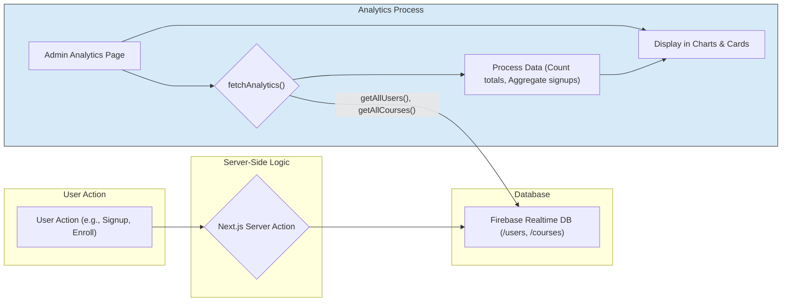
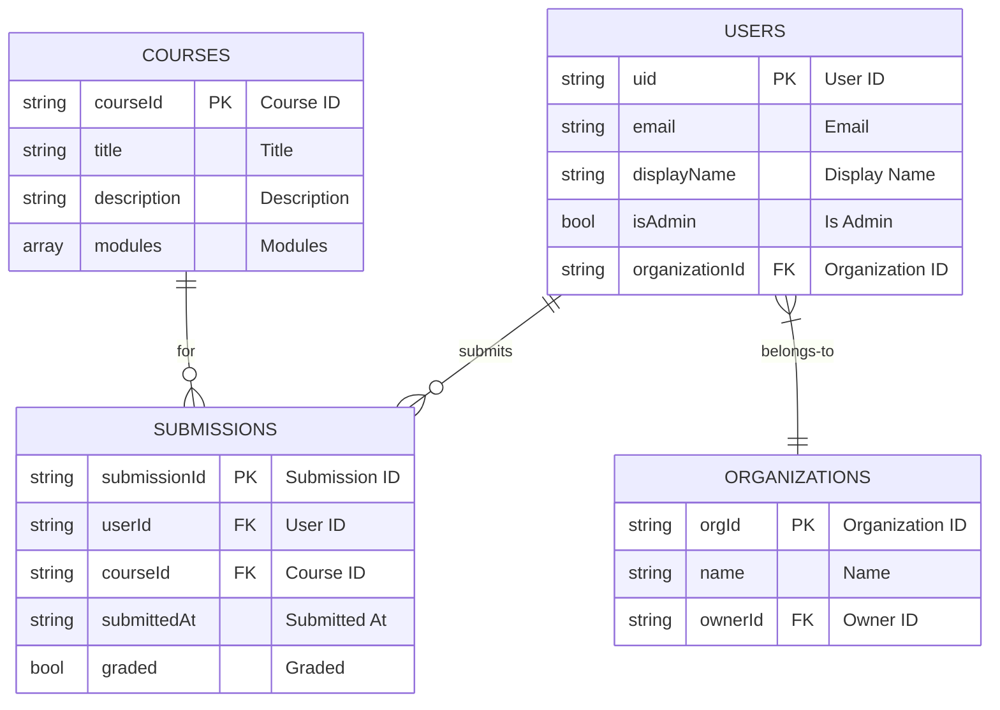

# Akili AI - Visual Framework

This document provides a visual representation of the application's architecture, user flows, and component interactions using Mermaid diagrams.

## High-Level Architecture
This diagram provides a bird's-eye view of the entire application stack. It shows the main layers: the client-side (what the user sees in their browser), the server-side (our Next.js backend), the backend services (Firebase and Genkit), and the AI/ML layer (Google AI Platform). It illustrates the primary flow of data and control between these major components.

## Component Architecture Diagram
This diagram shows how different UI components interact and form the user interface. It is organized into three main categories: Pages (which represent different routes), Shared Components (reusable elements like headers and footers), and UI Primitives (the basic building blocks from ShadCN). This helps visualize how the frontend is constructed in a modular way.

## Security Visual Framework
This diagram illustrates the security layers, from user authentication to database access rules. It shows how a user's request is authenticated via Firebase Authentication, resulting in a token that is used to make secure requests to the backend. The backend then relies on Firebase's Database Security Rules to ensure that users can only access the data they are authorized to see.

## Cyber Security Threat Model
This diagram illustrates potential threats and the implemented mitigations at different layers of the application. It maps common attack types (Threat Vectors) like Cross-Site Scripting (XSS) and Insecure Direct Object References (IDOR) to the specific architectural layers they target. Most importantly, it shows the corresponding security measures (Mitigations) that have been implemented to defend against these threats.

## Data Analytics Flow
This diagram shows the flow of data from user actions to the analytics dashboard. It begins with a user performing an action (like enrolling in a course), which triggers a server action to save data to the Firebase Database. The analytics page then fetches this raw data, processes it into meaningful aggregates (like totals and counts), and finally displays it in the dashboard's charts and cards.

## Database Framework
This diagram shows a simplified version of the Firebase Realtime Database schema and the relationships between different data entities. It uses an Entity-Relationship (ER) format to define the main data nodes (Users, Courses, Submissions, Organizations) and illustrates how they are connected, such as a User submitting a Submission for a Course.

