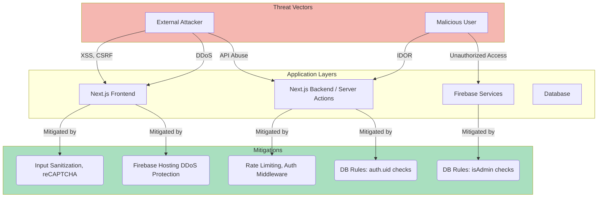
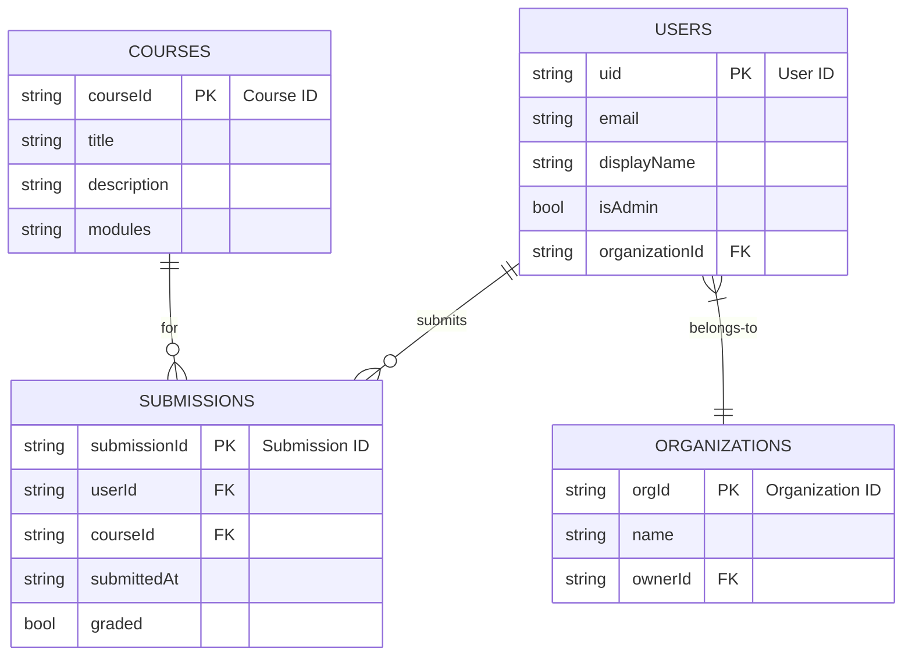

# Akili AI - Visual Framework

This document provides a visual representation of the application's architecture, user flows, and component interactions using Mermaid diagrams.

## High-Level Architecture

```mermaid
graph TD
    subgraph CLIENT [Client (Next.js/React)]
        A[User Interface] --> B{React Components};
        B --> C[ShadCN UI];
        B --> D[Tailwind CSS];
        A --> E[Next.js App Router];
    end

    subgraph SERVER [Server-Side (Next.js)]
        E --> F[Server Components];
        E --> G[Server Actions];
    end

    subgraph BACKEND [Backend Services]
        H[Firebase Auth]
        I[Firebase Realtime DB]
        J[Genkit AI Flows]
    end

    G --> H;
    G --> I;
    G --> J;

    F --> I;

    subgraph AIML [AI/ML (Genkit)]
        J --> K[Google AI Platform];
    end

    style CLIENT fill:#D6EAF8,stroke:#333,stroke-width:2px
    style SERVER fill:#D1F2EB,stroke:#333,stroke-width:2px
    style BACKEND fill:#FCF3CF,stroke:#333,stroke-width:2px
    style AIML fill:#FDEDEC,stroke:#333,stroke-width:2px
```

## Component Architecture Diagram

This diagram shows how different UI components interact and form the user interface.

```mermaid
graph TD
    subgraph PAGES [Pages]
        P1[Course Player Page]
        P2[Admin Dashboard]
        P3[Home Page]
    end

    subgraph SHARED [Shared Components]
        C1[Header]
        C2[Footer]
        C3[Sidebar]
        C4[CourseCard]
        C5[MpesaModal]
    end

    subgraph PRIMITIVES [UI Primitives (ShadCN)]
        U1[Button]
        U2[Card]
        U3[Dialog]
        U4[Input]
    end

    P1 --> C1;
    P1 --> C2;
    P1 --> C3;
    P2 --> C1;
    P2 --> C2;
    P2 --> C3;
    P3 --> C1;
    P3 --> C2;
    P3 --> C4;

    C4 --> U1;
    C4 --> U2;
    C5 --> U3;
    C5 --> U1;
    C5 --> U4;
    P1 --> U1;
    P2 --> U2;

    style PAGES fill:#E8DAEF,stroke:#333,stroke-width:2px
    style SHARED fill:#D4E6F1,stroke:#333,stroke-width:2px
    style PRIMITIVES fill:#D6EFE5,stroke:#333,stroke-width:2px
```

## Security Visual Framework

This diagram illustrates the security layers, from user authentication to database access rules.


## Cyber Security Threat Model

This diagram illustrates potential threats and the implemented mitigations at different layers of the application.



## Data Analytics Flow

This diagram shows the flow of data from user actions to the analytics dashboard.

```mermaid
graph LR
    A["User Action<br/>(e.g., Signup, Enroll)"] --> B{Next.js Server Action};
    B --> C["Firebase Realtime DB<br/>/users, /courses"];
    
    subgraph ANALYTICS [Analytics Process]
        D[Admin Analytics Page] --> E{fetchAnalytics()};
        E -->|getAllUsers(), getAllCourses()| C;
        E --> F["Process Data<br/>(Count totals, Aggregate signups)"];
        F --> G[Display in Charts & Cards];
    end
    
    D --> G;

    style ANALYTICS fill:#D6EAF8,stroke:#333,stroke-width:1px
```

## Database Framework

This diagram shows a simplified version of the Firebase Realtime Database schema and relationships.


